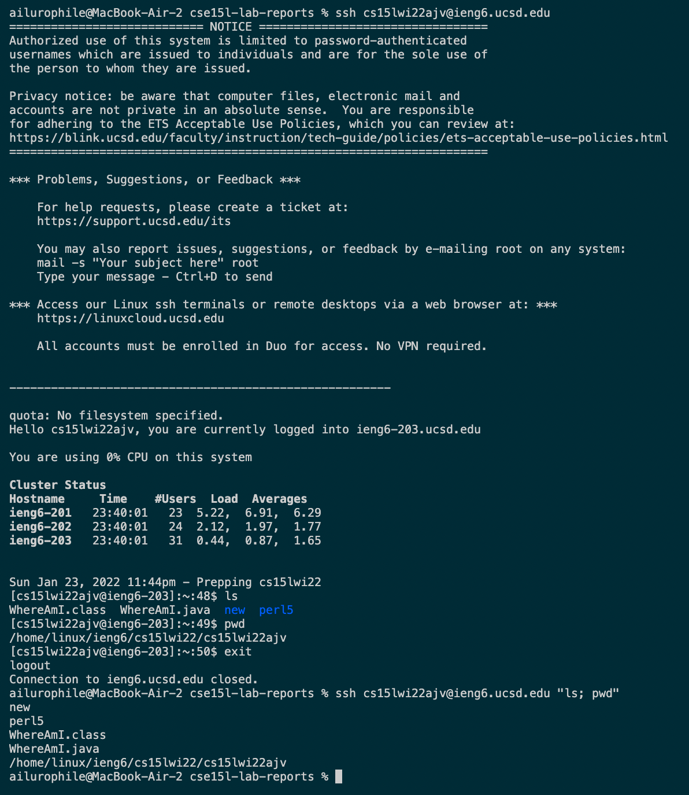

# Tutorial on Logging into a Couse-Specific Account on `ieng6`

>Installing VScode
* Download the [Visual Studio Code](https://code.visualstudio.com/). Follow the instructions on the website to install it.
* If everything goes well, you should see a window like this.


>Remotely Connecting
* Go to the *Terminal* tab of VSCode and click on *New Terminal*. Enter the secure shell command. Mine looks like this 👇

`$ ssh cs15lwi22ajv@ieng6.ucsd.edu`
* Then enter your passwords. Hopefully you'll get an out put like this 👇


>Trying Some Commands
* Try `cd`, `ls`, `pwd`, `mkdir`, `cp` in the command line. 
* Don't forget to exit in the end. You can do it by simply entering `exit`.


>Moving Files with `scp`
* First, create a file called `WhereAmI.java` and put the following code in it. 
```
class WhereAmI {
  public static void main(String[] args) {
    System.out.println(System.getProperty("os.name"));
    System.out.println(System.getProperty("user.name"));
    System.out.println(System.getProperty("user.home"));
    System.out.println(System.getProperty("user.dir"));
  }
}
```
* Don't log in yet! On the client machine(your laptop/computer), enter code like this:
`scp WhereAmI.java cs15lwi22ajv@ieng6.ucsd.edu:~/`. Theh enter your password.
* Log into *ieng6* with `ssh` again. 
* Use `ls`. WhereAmI.java should be in your directory right now.


>Setting an SSH Key
* Entering password everytime you log in is too time consuming! We can use *ssh* keys to create a pair of files called *public key* and *private key*.
* To set up, enter `ssh-keygen` on client first. Then follow the instruction to enter file in which to save the key. No need to set a passphrase.
* Log into your ieng6 account. Run `mkdir .ssh`. Then log out. Use `scp` to copy the public key to this directory by following what I have done. 


>Optimize Remote Running
Some hints for saving time:
* Use the arrows to go back to the commands that I’ve just used.
* Write a command in quotes after `ssh` to directly run on the remote server and log out. 
* Use semicolons to run multiple commands on the same line.


