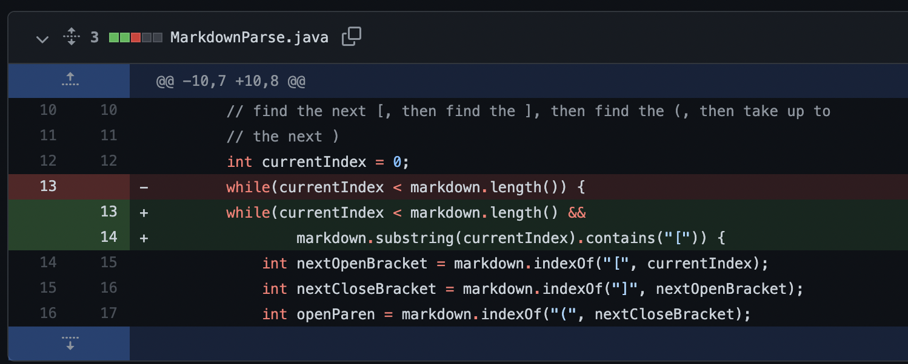
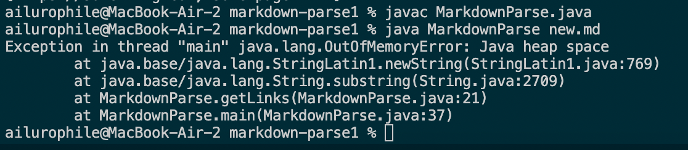
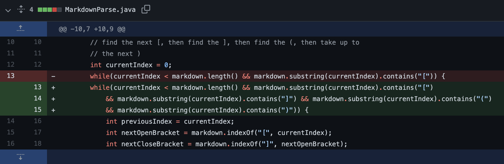
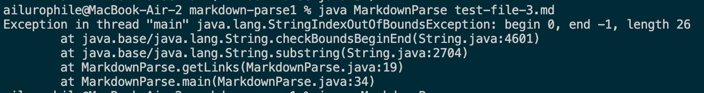
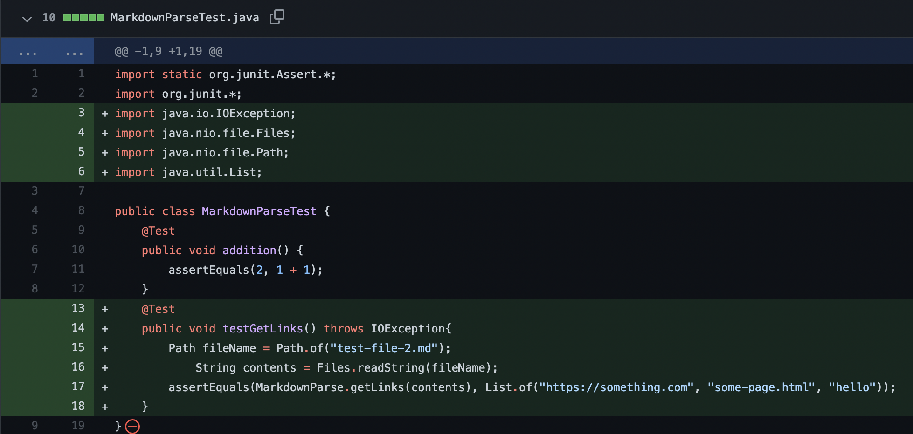
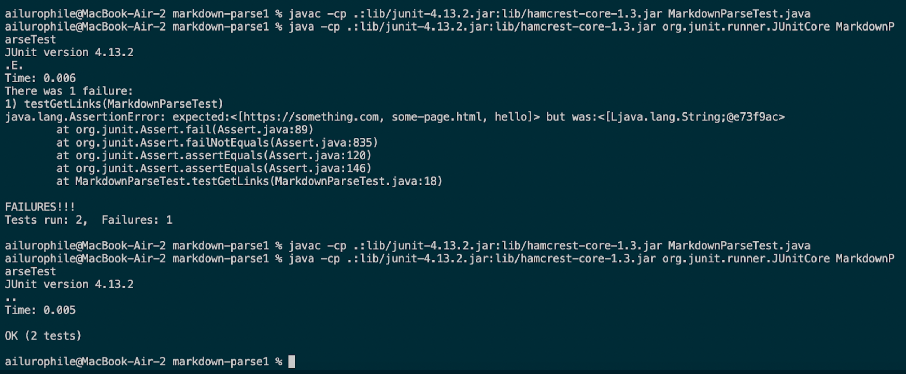

# Fixing bugs

>**Code Change #1**

* [new.md](https://github.com/cty3/markdown-parse/blob/main/new.md) prompted me to make the change at line 13 and 14, which aimed to solve the _infinite loop_ problem.
* The symptom looks like this in the output👇

* In this case, the bug is that the while loop doesn't stop searching for the next open bracket even if there is no more of them. The bug leads to the symptom that an OutOfMemoryError is thrown. The failure-inducing input contains content after the last closing parenthesis and leads to the infinite loop. By adding an extra condition, checking if there's any more open bracket in the following content, we fixed this bug.
---
>**Code Change #2**

* [test-file-3.md](https://github.com/cty3/markdown-parse/blob/main/test-file-3.md) prompted me to make the change at line 14, which aimed to solve the _IndexOutOfBoundException_.
* The symptom looks like this in the output👇

* In this case, the bug is that the while loop keeps going even if there's no "(", leading to the IndexOutOfBoundException symptom. The failure-inducing input induced this error by including "[]" but no "(" and the index for next open parenthesis becomes -1, causing the error in the following step. By adding more conditions in the while loop, the IndexOutOfBoundException wouldn't appear again in this loop.
---
>**Code Change #3**

* [MarkdownParseTest.java](https://github.com/cty3/markdown-parse/blob/main/MarkdownParseTest.java) prompted me to make the change, which aimed to unify the type of expected and actual output in the test.
* The symptom looks like this in the output👇

* Although it may seem not clear in the screenshot, I used the List.of() function to creat a temporary ArrayList in accrodance with the output of getLinks(). The bug in this case was that in the beginning my expected value is an Array, and the symptom was that the test failed. The failure-inducing input is just running the test in command line and returning an ArrayList through getLinks(). By using the List.of() function, I resolved the error and ran the test successfully.
