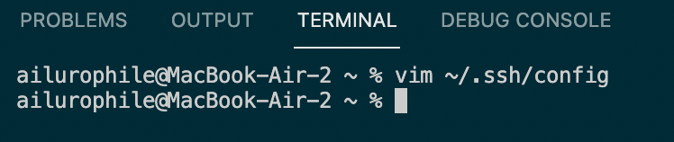
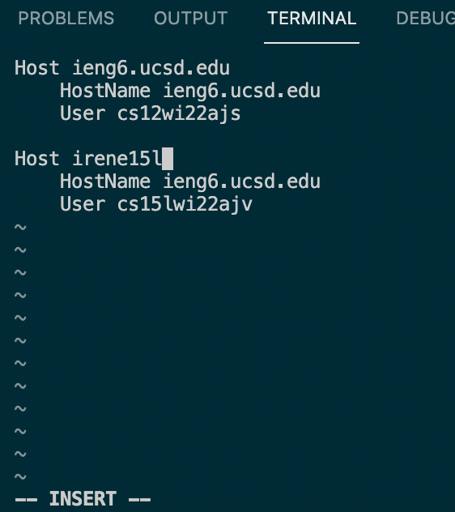
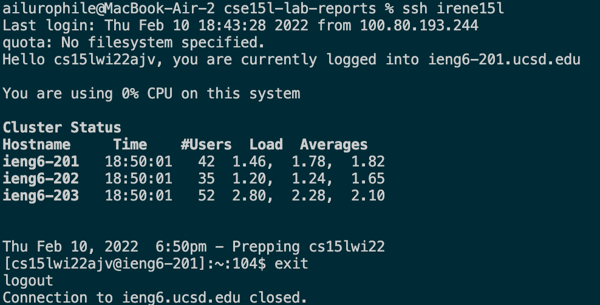
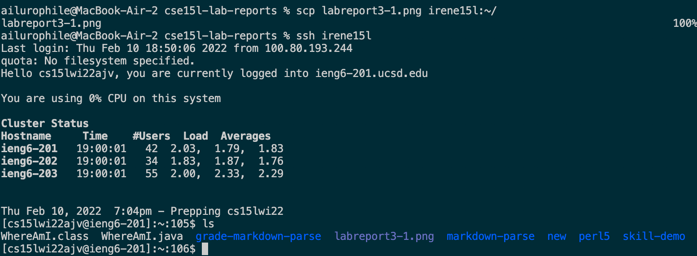

# Streamlining SSH Configuration

> **My `.ssh/config` file**

* I edited my `.ssh/config` file using vim

* I then changed my alias to `irene15l` in the insert mode.

> **Logging into my account using my alias**

* I logged into my account by simply entering the `ssh irene15l` command

> **Copying a file to my account using my alias**

* I used `scp labreport3-1.png irene15l:~/` to copy the file to my account.
* I then logged into my account and entered `ls` to check if the file is successfully copied into my account.

