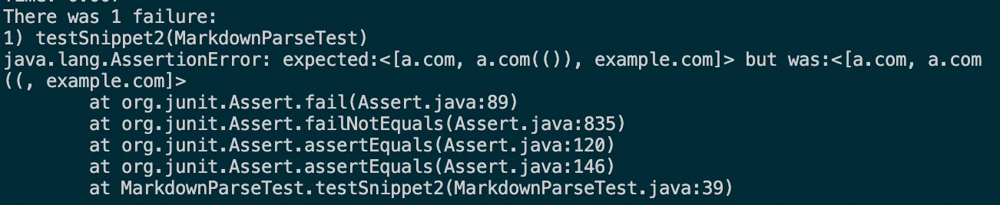

# MarkdownParse Snippet Tests
[My implementation can be found here](https://github.com/cty3/markdown-parse.git)

[The implementation I reviewed can be found here](https://github.com/maotcha/markdown-parse)

*Since the implementation I reviewed changed the header of the getLinks method, my methods for both implementations would differ for each snippet

> **Snippet 1**

* I used VScode preview to decide what it should produce: url.com, `google.com, google.com, ucsd.edu

**My implementation**
* Code in the test
```
@Test
public void testSnippet1() throws IOException {
    Path filename = Path.of("snippet1.md");
    String contents = Files.readString(filename);
    assertEquals(List.of("url.com", "`google.com", "google.com", "ucsd.edu"), MarkdownParse.getLinks(contents));
    }
```
* My implementation didn't pass the test.
* Output:


* There is a small code change that can make my program work for snippet 1 and all related cases that use inline code with backticks. When checking for brackets and parentheses with stuff between them, and empty links, I modified the if statement to make it check that char before open parenthesis is ']' and successfully solved the error caused by close brackest interrupted by backsticks.
```
if (markdown.charAt(openParen-1)==']' && openParen + 1 != closeParen) {
    toReturn.add(markdown.substring(openParen + 1, closeParen));
}
```

**The implementation I reviewed**
* Code in the test
```
@Test
public void testSnippet1() throws IOException {
    Path filename = Path.of("snippet1.md");
    String contents = Files.readString(filename);
    String[] contentsArray = contents.split("\n");
    assertEquals(MarkdownParse.getLinks(contentsArray), List.of("url.com", "`google.com", "google.com", "ucsd.edu"));
}
```
* The implementation I reviewed passed the test.

> **Snippet 2**

* I used VScode preview to decide what it should produce: a.com, b.com, a.com(()), example.com

**My implementation**
* Code in the test
```
@Test
 public void testSnippet2() throws IOException {
    Path filename = Path.of("snippet2.md");
    String contents = Files.readString(filename);
    assertEquals(List.of("a.com", "b.com", "a.com(())", "example.com"), MarkdownParse.getLinks(contents));
}
```

* My implementation didn't pass the test.
* Output:



* It's possible to make my program work for a nested parenthesized url, as I'll only need to make sure that getLinks return the content between first open paren after the closing bracket and the last closing paren before the next open bracket. However, I think the nested link is tricky, as we might need to introduce some parenthesis&bracket pairing function to fix the code.

**The implementation I reviewed**
* Code in the test
```
@Test
public void testSnippet2() throws IOException {
    Path filename = Path.of("snippet2.md");
    String contents = Files.readString(filename);
    String[] contentsArray = contents.split("\n");
    assertEquals(List.of("a.com", "b.com", "a.com(())", "example.com"), MarkdownParse.getLinks(contentsArray));
}
```
* The implementation I reviewed didn't pass the test.
* Output: 


> **Snippet 3**

* I used CommonMark demo site to decide what it should produce: https://ucsd-cse15l-w22.github.io/

**My implementation**
* Code in the test: 
```
@Test
public void testSnippet3() throws IOException {
    Path filename = Path.of("snippet3.md");
    String contents = Files.readString(filename);
    assertEquals(List.of("https://ucsd-cse15l-w22.github.io/"), MarkdownParse.getLinks(contents));
}
```
* My implementation didn't pass the test.
* Output:


* It would need more than 10 line to fix it. First, we need to use readString to make sure that the link output doesn't have blank spaces around it. Secondly, we need to somehow introduce functions to skip the current set of brackets/parentheses when contents in them have super long line breaks, as well as when brackets/parentheses are not paired before the next link.

**The implementation I reviewed**
* Code in the test
```
@Test
public void testSnippet3() throws IOException {
    Path filename = Path.of("snippet3.md");
    String contents = Files.readString(filename);
    String[] contentsArray = contents.split("\n");
    assertEquals(List.of("https://ucsd-cse15l-w22.github.io/"), MarkdownParse.getLinks(contentsArray));
}
```
* The implementation I reviewed didn't pass the test.
* Output: 

