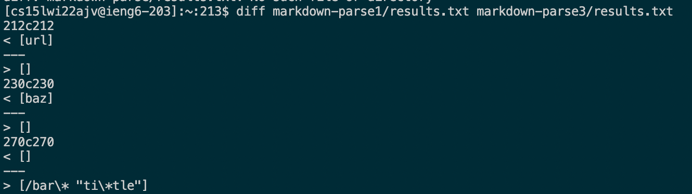
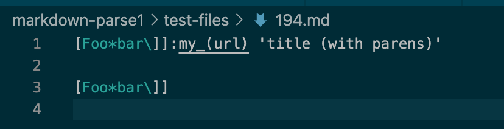
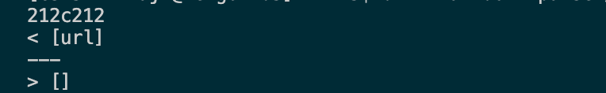
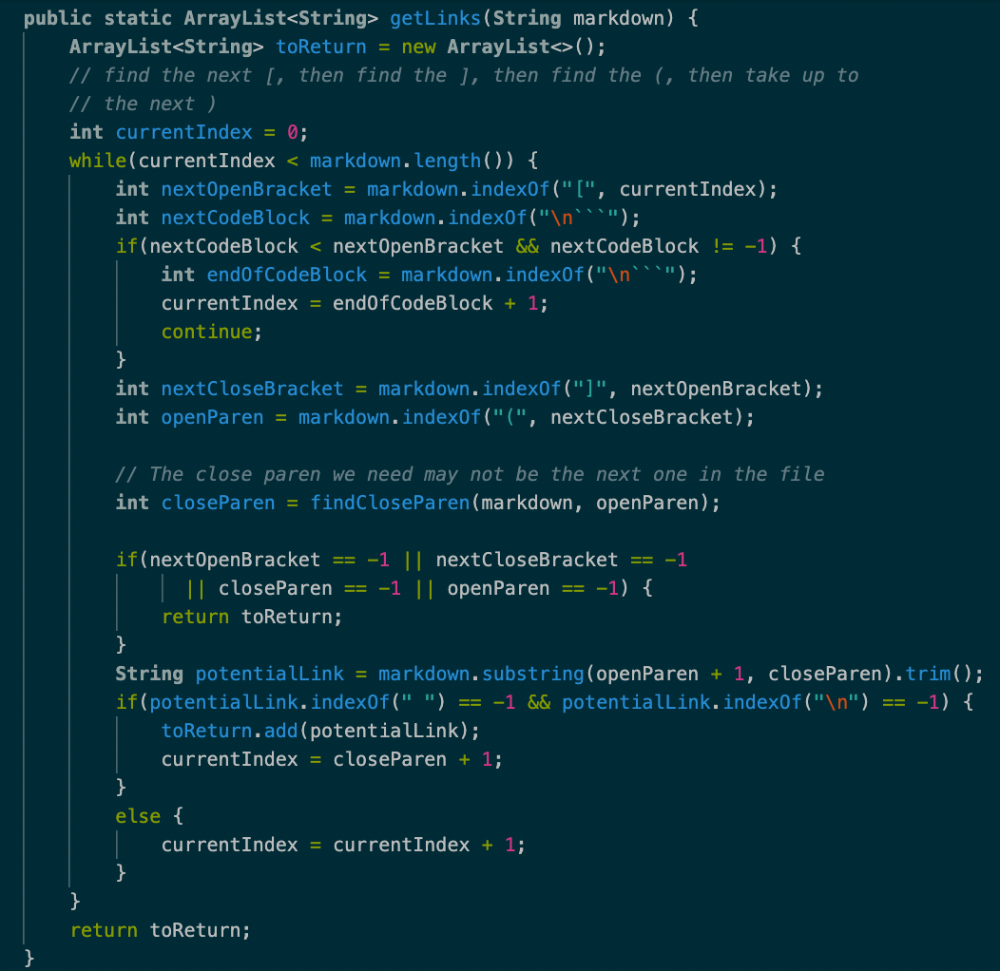
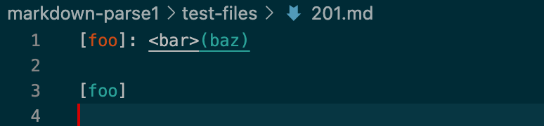
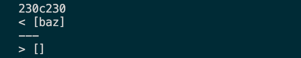

# Two Bugs in My Implementation

* I used `diff` to find the tests with different results.

> **Test 194**

**File content looks like this:**

**My result v.s. the other result**

 * I think both implementations are incorrect. The program should return a link which contains parentheses: my_(url).

 * My implementation is not correct. The bug is that it ignores the case in which the label in brackets followed  by a colon and the link can also represent a link. 
 
 * After checking the existence of opening and closing brackets, I should check if there's any colon that imediately follows. If so, the content after the colon should be parsed as a link as well.

 

> **Test 201**

**File content looks like this:**

**My result v.s. the other result**

* I think the provided implementations is correct. The program should return an empty list, since brackets and parentheses are interrupted by angle brackets.

* My mplementation is incorrect. The bug is that it doesn't take care of the case in which a pair of angle brackets interrupt the link.

* The fix should also be in the getLinks method, as shown in the previous test. After looking for brackets, it should also look for angle brackets and stop parsing the content in the following parenthesis if the angle brackets present.